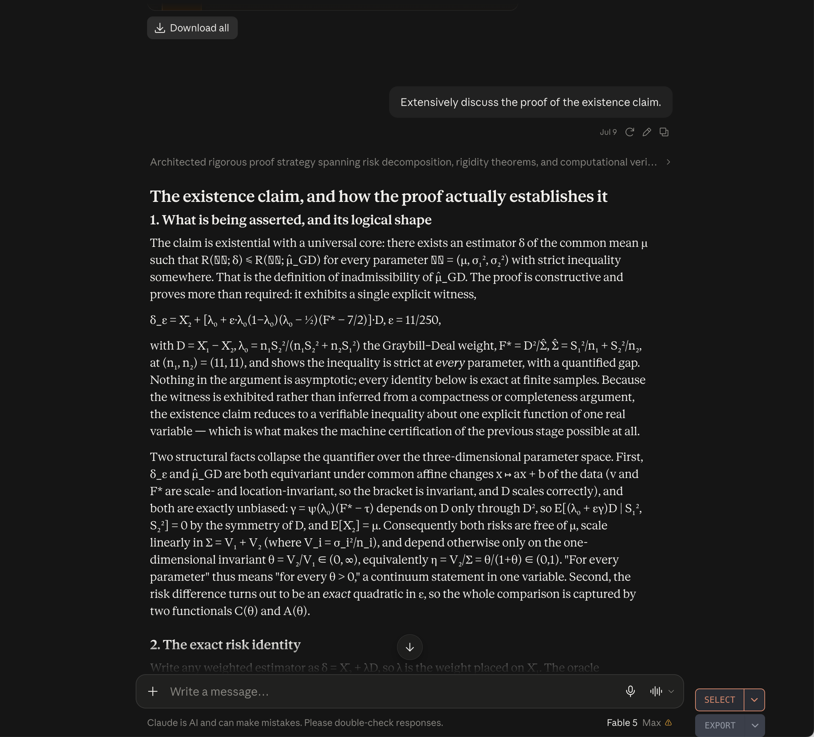

# Provenance and independent development

I acknowledge [Dale Matthews’s valuable work](https://github.com/dalematthews/graybill-deal-inadmissibility) on the Graybill–Deal problem. While some of his results overlap with mine, I developed this research independently, without relying on his work. My retained internal research records date my initial explicit (11,11) result to July 9, 2026, preceding his initial public release on July 24, 2026.

## Dated research evidence

Ashwin Sanjay is the sole author of this research. The retained research chronology records his July 9 internal derivation of an explicit everywhere-strict dominating estimator at (11,11). The July 9 date is recorded in the retained conversation export. The underlying conversation export is retained privately and is not included in this distribution.

The [public-event record](provenance/PublicEvent.json) and [root-commit verification](provenance/PublicCommit.json) support the July 24 date of Matthews’s public release.

Screenshot of the retained Claude/Fable conversation showing the explicit (11,11) dominating estimator and its everywhere-strict risk improvement over Graybill–Deal. The matching assistant response is dated July 9, 2026, 18:31:38 in the retained conversation export.

## Attribution

Preserve named authors and the source attributions associated with individual works. The research attribution above does not assert ownership of third-party dependency code or external records. See [LICENSE](../LICENSE) and [third-party notices](../THIRD_PARTY_NOTICES.md).
